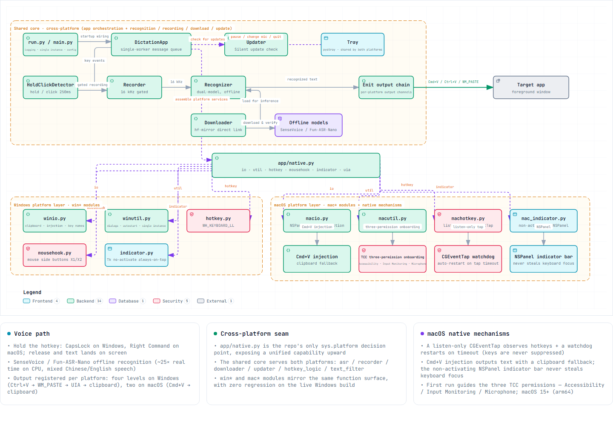

# xxl-whisper

> 🌐 [中文](README.md) · **English**

[](https://xianglun918.github.io/xxl-whisper/)
[](https://github.com/xianglun918/xxl-whisper/releases/latest)
[](https://github.com/xianglun918/xxl-whisper/blob/main/LICENSE)

A dual-platform (Windows/macOS) offline voice dictation tool: hold the hotkey (CapsLock on Windows / Right Command on macOS), speak, release and the text is inserted at the cursor. It runs fully local with no network, and handles mixed Chinese–English speech.

[](https://xianglun918.github.io/xxl-whisper/architecture.en.html)

## Quick start

1. **Download** — [Windows `xxl-whisper.exe`](https://github.com/xianglun918/xxl-whisper/releases/latest) or [macOS `xxl-whisper-arm64.zip`](https://github.com/xianglun918/xxl-whisper/releases/latest) (macOS: Apple silicon + 15 or later; first launch is right-click → Open)
2. **Run** — the first launch auto-downloads the speech model (~230MB, with a progress indicator)
3. **Use** — hold the hotkey, speak, release; a single CapsLock tap still toggles case

## Features

- Fully local, offline recognition (SenseVoice-Small / Fun-ASR-Nano) — works with no network
- Mixed Chinese–English speech ("open a PR", "check the README")
- Automatic insertion fallback for every kind of input field (4 levels on Windows / 2 on macOS)
- Hotkeys your way: CapsLock / F keys / mouse side buttons / custom
- Semantic smoothing: one click removes "um/uh/ah" fillers, repetitions and slips (Fun-ASR-Nano)
- The indicator never steals focus and auto-hides in exclusive fullscreen; silent update checks on launch

## Documentation

| | |
|---|---|
| 🌐 Website | https://xianglun918.github.io/xxl-whisper/ |
| 📖 Usage & Distribution Guide | [docs/使用与分发说明.en.md](docs/使用与分发说明.en.md) — install, FAQ, config, models / proxy / manual download, known limits, macOS details, maintainer release |
| 🗺️ Interactive architecture | [online](https://xianglun918.github.io/xxl-whisper/architecture.en.html) · [JSON source](docs/architecture.en.json) |

## Development

```bash
uv sync                  # create the virtualenv and install dependencies
uv run pytest tests -q   # unit + integration tests (model must be downloaded)
uv run python run.py     # run from source
build.bat                # Windows build -> dist\xxl-whisper.exe
bash build.sh            # macOS build -> dist/xxl-whisper-arm64.zip
```

## License

MIT
