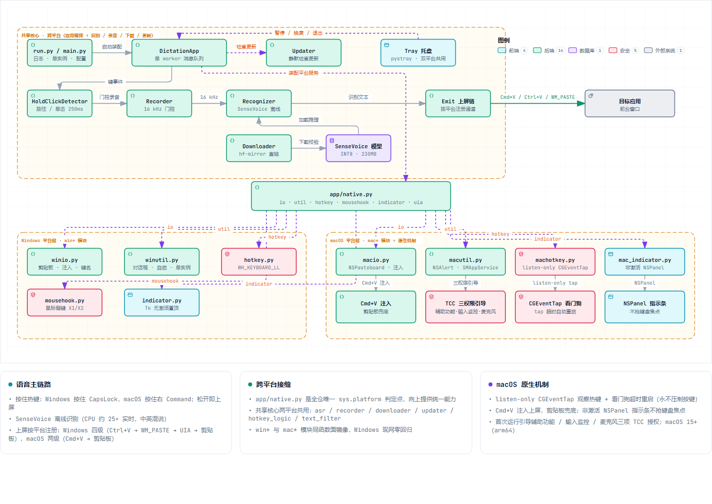

# xxl-whisper

> 🌐 **中文** · [English](README.en.md)

[](https://xianglun918.github.io/xxl-whisper/)
[](https://github.com/xianglun918/xxl-whisper/releases/latest)
[](https://github.com/xianglun918/xxl-whisper/blob/main/LICENSE)

Windows / macOS 双平台离线语音听写工具：**按住热键说话（Windows CapsLock / macOS 右 Command），松开后文字直接上屏到光标处**。识别纯本地完成，无需联网，支持中英混说。

[](https://xianglun918.github.io/xxl-whisper/architecture.html)

## 快速开始

1. **下载** — [Windows `xxl-whisper.exe`](https://github.com/xianglun918/xxl-whisper/releases/latest) 或 [macOS `xxl-whisper-arm64.zip`](https://github.com/xianglun918/xxl-whisper/releases/latest)（macOS：Apple 芯片 + 15 及以上，首次打开右键 → 打开）
2. **运行** — 首次会自动下载语音模型（约 230MB，底部有进度提示）
3. **使用** — 按住热键说话，松开出字；单击 CapsLock 仍是大小写切换

## 特性

- 纯本地离线识别（SenseVoice-Small / Fun-ASR-Nano），断网可用，隐私无忧
- 中英混说（"开个 PR"、"看下 README"）
- 上屏通道自动降级，兼容各类输入框（Windows 四级 / macOS 两级）
- 热键自由：CapsLock / F 键 / 鼠标侧键 / 自定义
- 语义顺滑：一键去「嗯/呃/啊」语气词、重复、口误（Fun-ASR-Nano）
- 状态条永不抢焦点，独占全屏自动隐藏；启动静默检查更新

## 文档

| | |
|---|---|
| 🌐 官网 / 落地页 | https://xianglun918.github.io/xxl-whisper/ |
| 📖 使用与分发说明 | [docs/使用与分发说明.md](docs/使用与分发说明.md) — 安装、常见问题、配置、模型 / 代理 / 手动下载、已知边界、macOS 详情、维护者发版 |
| 🗺️ 交互式架构图 | [线上版](https://xianglun918.github.io/xxl-whisper/architecture.html) · [JSON 源](docs/architecture.json) |

## 开发

```bash
uv sync                  # 建虚拟环境装依赖
uv run pytest tests -q   # 单测 + 集成测试（需已下载模型）
uv run python run.py     # 源码运行
build.bat                # Windows 打包 -> dist\xxl-whisper.exe
bash build.sh            # macOS 打包 -> dist/xxl-whisper-arm64.zip
```

## 许可

MIT
