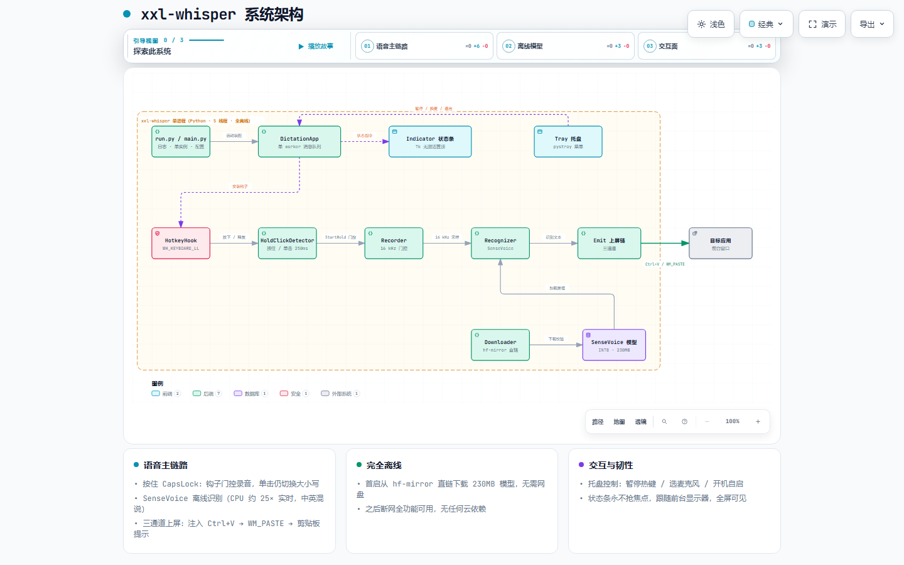

# xxl-whisper

Windows 托盘常驻的离线语音听写工具：**按住 CapsLock 说话，松开后中文直接上屏到光标处**。

> 📖 **[使用与分发说明](docs/使用与分发说明.md)** — 给使用者的安装/常见问题一页纸，给维护者的打包/发版流程。

## 系统架构

[](docs/architecture.html)

**主链路**：HotkeyHook（CapsLock 拦截）→ HoldClickDetector（按住/单击判定）→ Recorder（16 kHz 门控录音）→ Recognizer（SenseVoice 离线识别）→ Emit（三通道上屏：注入 Ctrl+V → WM_PASTE → 剪贴板提示）→ 目标应用光标处。

👆 点击图片打开**交互式架构图**（`docs/architecture.html`，支持明暗主题、缩放、聚焦与导出；JSON 源在 `docs/architecture.json`）。

- 纯本地识别（SenseVoice-Small，CPU 实时 25 倍速），无网可用，不依赖任何云服务和网盘
- 中英混说（"开个 PR"、"看下 README"）
- 单击 CapsLock 仍是大小写切换（原功能不破坏）
- 托盘菜单：暂停热键 / 选麦克风 / 开机自启 / 退出

## 首次使用（最终用户）

1. 拿到 `xxl-whisper.exe`，双击运行（首次会自动从 hf-mirror 下载约 230MB 模型，有进度提示）
2. 托盘出现图标即就绪。按住 CapsLock 说话 → 松开 → 文字出现在当前输入焦点
3. 右键托盘图标可暂停、换麦克风、开机自启

配置文件：`%LOCALAPPDATA%\xxl-whisper\config.toml`（热键/阈值/线程数等，改完重启生效）
日志：`%LOCALAPPDATA%\xxl-whisper\logs\app.log`

## 开发

```bash
uv sync                     # 建虚拟环境装依赖
uv run pytest tests -q      # 单测 + 集成测试（需已下载模型）
uv run python run.py        # 源码运行
build.bat                   # PyInstaller 打包 -> dist\xxl-whisper.exe
```

## 架构

详见上方交互式架构图（`docs/architecture.html`）。线程模型：主线程跑托盘；钩子线程泵
Win32 消息；PortAudio 回调收音；单一 ASR worker 消费消息队列（热键事件与控制命令共用
一个 tagged union 队列，无锁竞争）。

## 模型

- SenseVoice-Small INT8 ONNX（239,233,841 字节）+ tokens.txt（315,894 字节）
- 来源：`hf-mirror.com/csukuangfj/sherpa-onnx-sense-voice-zh-en-ja-ko-yue-2024-07-17`
  （主源，国内直连）；GitHub release tar.bz2 兜底
- 存放：`%LOCALAPPDATA%\xxl-whisper\models\sensevoice\`
- 注意：modelscope 的 iic/SenseVoiceSmall-onnx 与 sherpa-onnx 轮子内置的 onnxruntime
  不兼容（ORT API 版本冲突），不要混用

## 已知边界

- 管理员窗口（提权的终端/软件）里上屏会被 UIPI 拦截 → 不支持
- **本机若有软件拦截键盘注入**（uTools/豆包/ArmouryCrate/G HUB 等带全局钩子的
  工具可能如此，症状：日志出现"本机拦截键盘注入"），自动回退为 WM_PASTE
  定点粘贴；若目标程序也不支持，文字保留在剪贴板并提示手动 Ctrl+V
- 杀软误报 Python 打包 exe：加白即可
